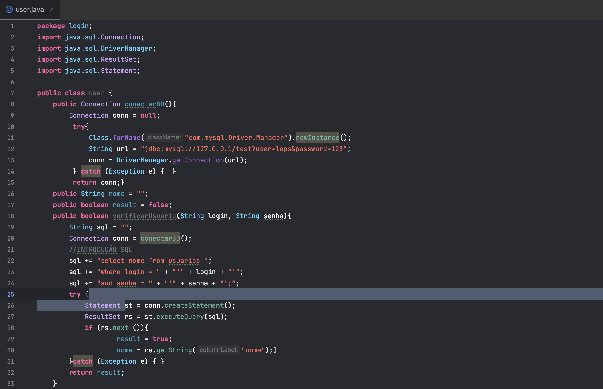
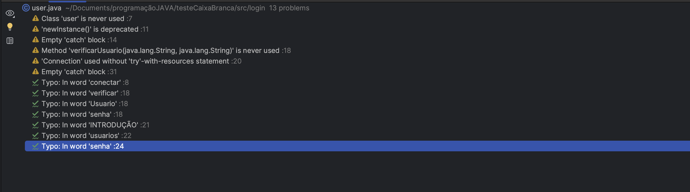
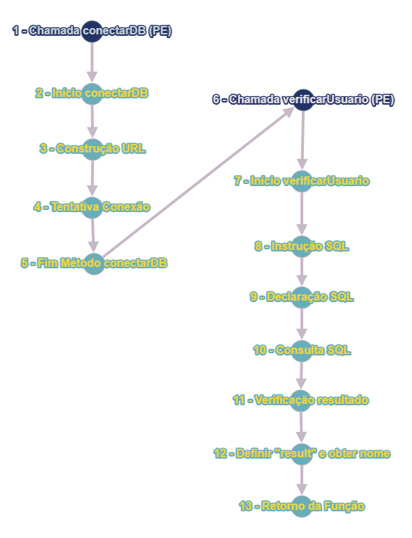

# testeCaixaBrancaTQS

## Descrição
O teste de caixa branca é uma técnica de teste de software que examina o código interno de um programa para avaliar sua lógica, estrutura e caminhos de execução, com o objetivo de encontrar erros e garantir uma cobertura abrangente do código-fonte.

 # 1- A DOCUMENTAÇÃO FOI DESCRITA NO CÓDIGO? 
 Não foi descrita no codigo, pois é possivel encontrar alguns erros.

 # 2- AS VARIÁVEIS E CONSTANTES POSSUEM BOA NOMENCLATURA?
Poderia ter nomes mais objetivos onde facilitaria a leitura e compreensão do codigo.

# 3- EXISTEM LEGIBILIDADE E ORGANIZAÇÃO NO CÓDIGO?
Existe ambas, o código esta bem estruturado e seguindo o padrão 

# 4- TODOS OS NULLPOINTERS FORAM TRATADOS?
Todos nullpointers foram tratados

# 5- A ARQUITETURA UTILIZADA FOI DEVIDAMENTE RESPEITADA?
Sim, ela foi devidamente respeitada

# 7- ERROS DO CÓDIGO 
1. Variavel urL nunca usada 
2. Falta de Fechamento de Conexão, onde pode ocorrer diversos problemas
3. " 'newInstance()' is deprecated" significa que ele foi descontinuado em favor de mecanismos mais novos e flexíveis para criar objetos.

#8- GRAFO DE FLUXO
 Segue a imagem

 
